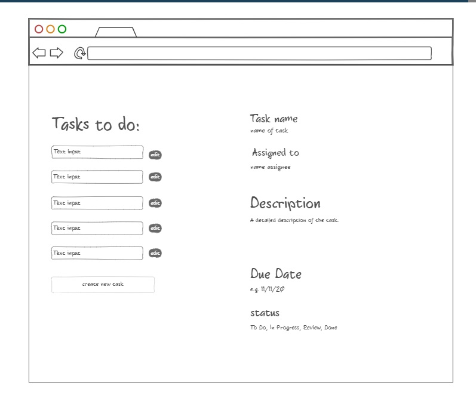
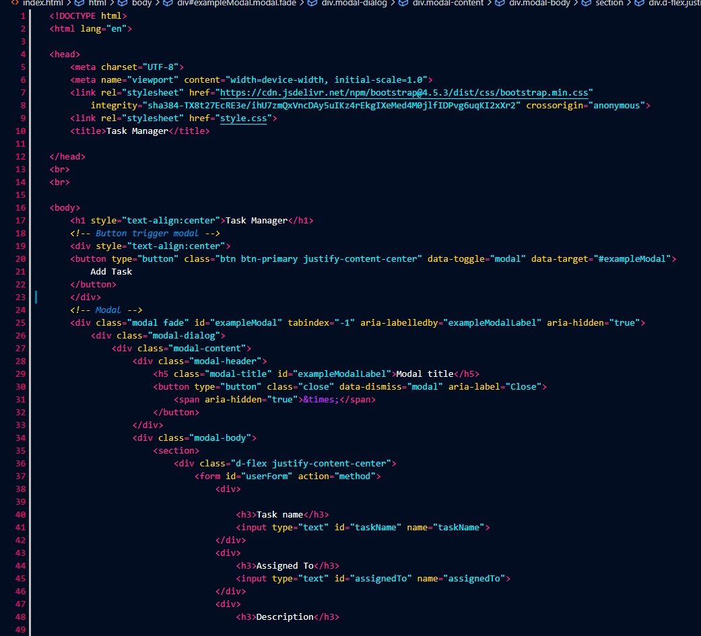
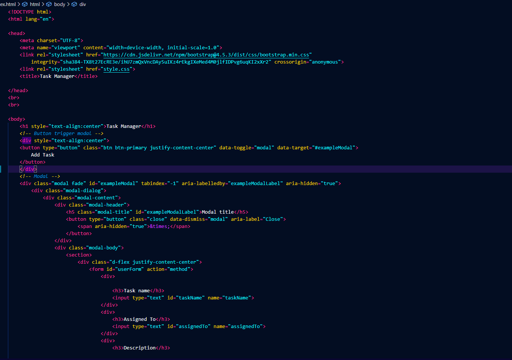
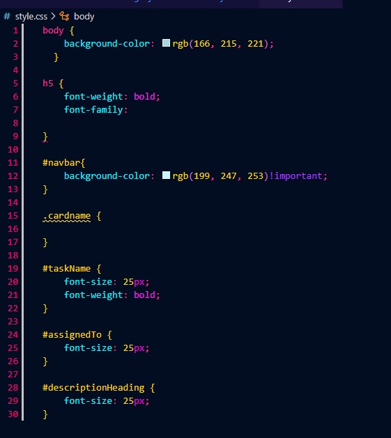

# Task manager
https://slade-de-plater.github.io/app-wireframe/

## Info

This project was developed to manage tasks within a team project. To keep track of tasks in a group project.

## Motivation

 We wanted to digitise a to do list, so we made a task manager

## Screenshots

### Task manager web view

### Wire-frame

### Code

#### HTML

#### CSS

#### JavaScript

## Features

* Submit tasks, with date, discirption, Assigned To, and status
* You are able to quickly mark a task as DONE
* delete tasks that are done. 

## Development environment
* ninjamock
* Vs code
* mocha
* Live share
* Live server
* Zoom
* slack

 

 
